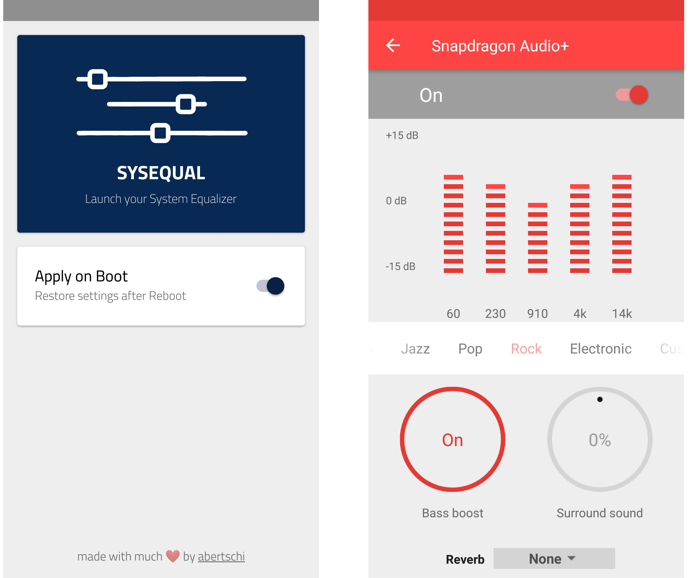

# sysequal

> Launch Android's builtin Equalizer

Sysequal (as in **Sys**tem **Equal**izer) is a small utility
application which launches Android's builtin Equalizer. Many flavors of Android
come with a decent Audio Equalizer builtin. The Equalizer is, however, not
always accessible in the system settings and limited to an per-application
basis. This app starts the Equalizer and restores
settings after a reboot.

## Download
- https://github.com/abertschi/sysequal/releases/download/latest/ch.abertschi.sysequal-1.0.apk

## FAQ
**Why doesn't it work?**  
Make sure you have no additional equalizers installed. If Sysequal
fails to load the Equalizer an error will show up in the app.

## License
MIT

## Autor
Andrin Bertschi, https://abertschi.ch
